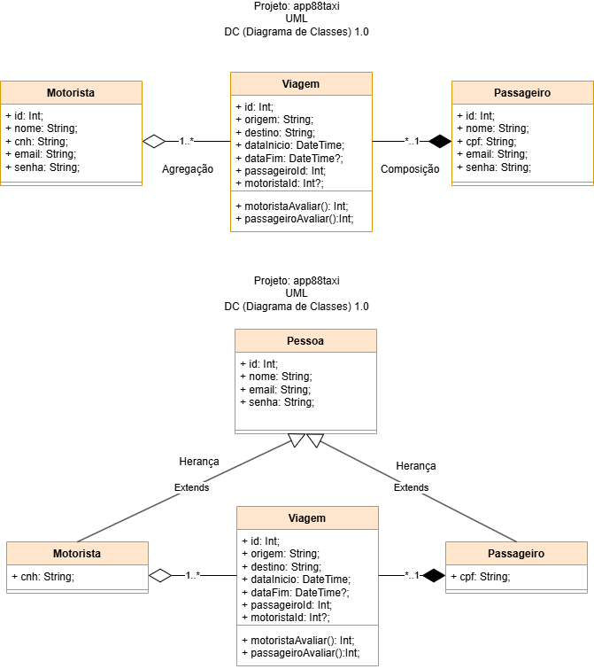

# Projeto: app88taxi
Exemplo de projeto de uma API de taxi utilizando o framework Node.js e o banco de dados MySQL.
## Tecnologias Utilizadas
- Node.js
- Prisma
- MySQL (XAMPP)
- Insomnia
## Estrutura do Projeto
